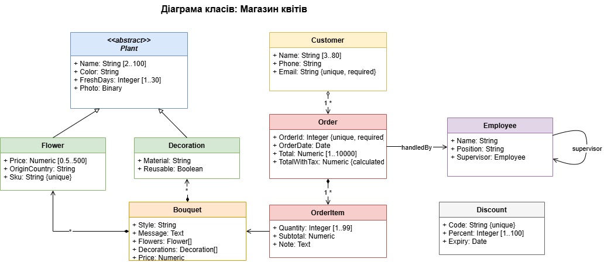
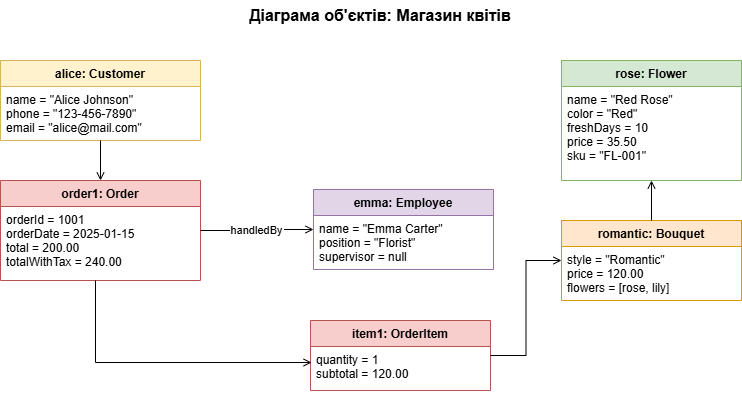
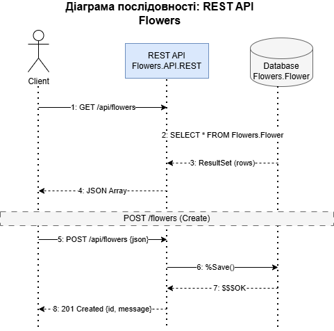

НАЦІОНАЛЬНИЙ ТЕХНІЧНИЙ УНІВЕРСИТЕТ УКРАЇНИ "КИЇВСЬКИЙ ПОЛІТЕХНІЧНИЙ ІНСТИТУТ ІМЕНІ ІГОРЯ СІКОРСЬКОГО”  
НАВЧАЛЬНО-НАУКОВИХ ІНСТИТУТ АТОМНОЇ ТА ТЕПЛОВОЇ ЕНЕРГЕТИКИ  
КАФЕДРА ЦИФРОВИХ ТЕХНОЛОГІЙ В ЕНЕРГЕТИЦІ

Виконав: студент групи ТР-52мп Плесканко А.В.

Перевірив: Волков О.В.

Київ – 2025

## Graphic Work

### 1. Схема реляційної БД

Схема відображає всі таблиці БД (Plant, Flower, Decoration, Customer, Employee, Order, OrderItem, Bouquet, Discount) з первинними/зовнішніми ключами та зв'язками між ними.

### 2. Діаграма класів

UML-діаграма класів показує структуру системи: спадкування (Plant → Flower, Decoration), асоціації, композиції та властивості з обмеженнями.

### 3. Діаграма об'єктів

Діаграма об'єктів демонструє конкретні екземпляри класів (alice:Customer, order1:Order, item1:OrderItem, romantic:Bouquet, rose:Flower) та зв'язки між ними.

### 4. Діаграма послідовності

Діаграма послідовності показує взаємодію Client → REST API → Database для операцій GET /flowers та POST /flowers.

### Висновок

Підготовлено 4 діаграми для проекту "Магазин квітів":
- **Схема реляційної БД** — структура таблиць та зв'язки (PK, FK, inheritance)
- **Діаграма класів** — UML-модель з властивостями, методами та типами зв'язків
- **Діаграма об'єктів** — конкретні екземпляри та їх взаємодія
- **Діаграма послідовності** — flow REST API запитів (GET, POST)

