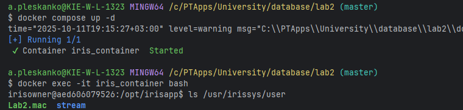
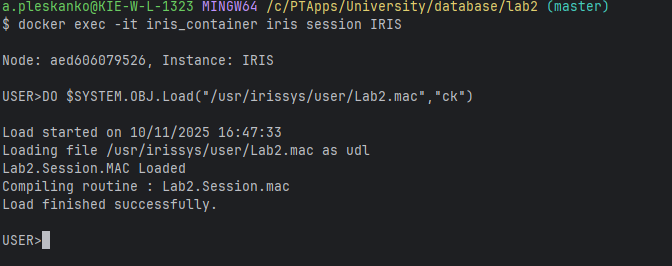
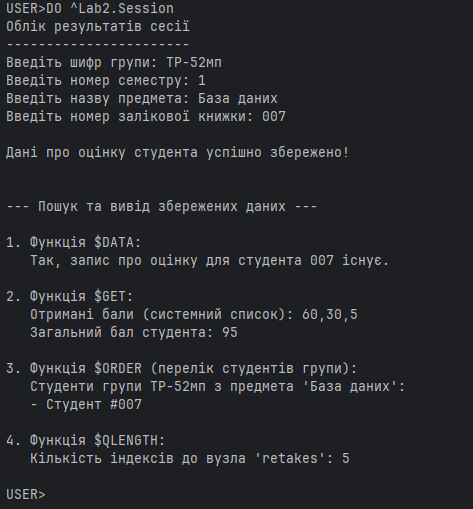

НАЦІОНАЛЬНИЙ ТЕХНІЧНИЙ УНІВЕРСИТЕТ УКРАЇНИ "КИЇВСЬКИЙ ПОЛІТЕХНІЧНИЙ ІНСТИТУТ ІМЕНІ ІГОРЯ СІКОРСЬКОГО”  
НАВЧАЛЬНО-НАУКОВИХ ІНСТИТУТ АТОМНОЇ ТА ТЕПЛОВОЇ ЕНЕРГЕТИКИ  
КАФЕДРА ЦИФРОВИХ ТЕХНОЛОГІЙ В ЕНЕРГЕТИЦІ

Виконав: студент групи ТР-52мп Плесканко А.В.

Перевірив: Волков О.В.

Київ – 2025

# Лабораторна робота №2

## Мета роботи
Створити глобальну змінну (global), яка має 4 підскрипти різних типів (числа, дати, рядки, списки).  
Використати для вузлів значення обох типів списків та продемонструвати використання щонайменше 4 вбудованих функцій для роботи з масивами.  
Всі параметри повинні зчитуватися з пристрою введення.

---

## Хід виконання
1. **Конфігурація середовища**  
   Налаштовання середовища InterSystems IRIS для роботи з ObjectScript.
   

2. **Завантаження файлу в IRIS**  
   Процес завантаження файлу лабораторної роботи у базу даних IRIS.
   

3. **Результат виконання**  
  Ілюстрація роботи глобальної змінної з 4 підскриптами та використанням списків, а також застосування чотирьох вбудованих функцій для роботи з масивами (`$ORDER`, `$GET`, `$LISTLENGTH`, `$LISTBUILD`).
   
---
## Використані функції
- `$ORDER()` — для ітерації по підскриптах глобалу
- `$GET()` — для отримання значення вузла глобалу
- `$LISTBUILD()` — для створення списку
- `$LISTLENGTH()` — для визначення довжини списку

---

## Висновки
- Було успішно створено глобал з 4 підскриптами різного типу.
- Було використано списки як значення для вузлів глобалу.
- Демонстровано роботу 4 вбудованих функцій для роботи з масивами.
- Всі параметри вводились через пристрій введення, що робить глобал динамічним та гнучким для використання.

---
