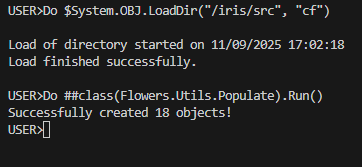
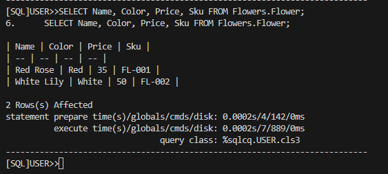
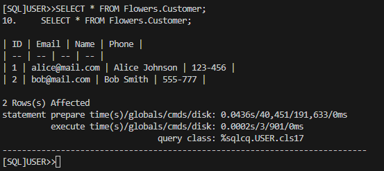

НАЦІОНАЛЬНИЙ ТЕХНІЧНИЙ УНІВЕРСИТЕТ УКРАЇНИ "КИЇВСЬКИЙ ПОЛІТЕХНІЧНИЙ ІНСТИТУТ ІМЕНІ ІГОРЯ СІКОРСЬКОГО”  
НАВЧАЛЬНО-НАУКОВИХ ІНСТИТУТ АТОМНОЇ ТА ТЕПЛОВОЇ ЕНЕРГЕТИКИ  
КАФЕДРА ЦИФРОВИХ ТЕХНОЛОГІЙ В ЕНЕРГЕТИЦІ

Виконав: студент групи ТР-52мп Плесканко А.В.

Перевірив: Волков О.В.

Київ – 2025

# Лабораторна робота №4

# UML-діаграма класів: Магазин квітів

## Тема
Створення класів у базі даних за діаграмою класів з Практики 3. Реалізація сутностей, зв'язків, обмежень та збереження об'єктів у БД.

## Мета
- Створити класи у БД згідно з діаграмою класів (Practice 3).
- Для кожного класу створити щонайменше 2 об'єкти, встановити всі властивості з урахуванням обмежень (unique, required тощо) та зберегти об'єкти у БД.
- Переконатися, що всі властивості мають осмислені значення, а зв'язки та обмеження працюють коректно.

### Короткий опис ключових класів та зв'язків

| № | Призначення | Опис для звіту |
|---|-------------|----------------|
| 1 | Клас Flowers.Flower | Клас Сутності (Об'єкти): Описує основні товари магазину. Доводить коректне використання спадкування від абстрактного класу Plant та дотримання унікальності (Sku). |
| 2 | Клас Flowers.Customer | Клас Сутності (Обмеження): Описує клієнта. Доводить коректне використання обмежень Unique та Required для властивості Email. |
| 3 | Зв'язок Order - Customer - Employee | Доказ Зв'язків та Композиції: Демонструє, що всі асоціативні зв'язки (One-to-Many/Aggregation) між сутностями Order, Customer, Employee та Bouquet були правильно налаштовані та збережені у базі даних (за допомогою Foreign Keys). |

### SQL-запити та результати

1. 
2. 
3. 
