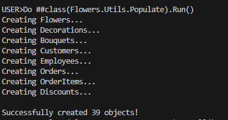
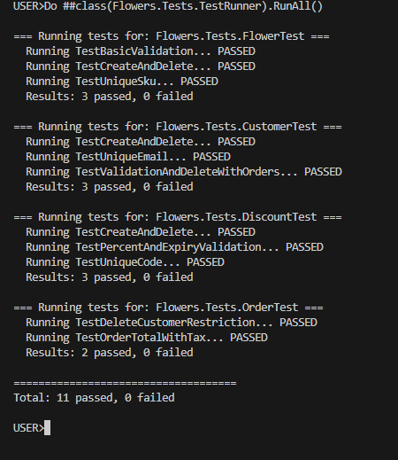

НАЦІОНАЛЬНИЙ ТЕХНІЧНИЙ УНІВЕРСИТЕТ УКРАЇНИ "КИЇВСЬКИЙ ПОЛІТЕХНІЧНИЙ ІНСТИТУТ ІМЕНІ ІГОРЯ СІКОРСЬКОГО”  
НАВЧАЛЬНО-НАУКОВИХ ІНСТИТУТ АТОМНОЇ ТА ТЕПЛОВОЇ ЕНЕРГЕТИКИ  
КАФЕДРА ЦИФРОВИХ ТЕХНОЛОГІЙ В ЕНЕРГЕТИЦІ

Виконав: студент групи ТР-52мп Плесканко А.В.

Перевірив: Волков О.В.

Київ – 2025

# Лабораторна робота №5

### Мета
- Реалізовано Always Computed Property (динамічно обчислювана властивість).
- Розроблено механізм автоматичного наповнення бази даних (Data Population).
- Створено набір Unit-тестів для перевірки цілісності даних, обмежень (Constraints) та зв'язків між об'єктами.

### Короткий опис реалізованих класів

| № | Клас                       | Опис реалізації |
|---|----------------------------|-----------------|
| 1 | Flowers.Order              | Computed Property: Реалізовано властивість `TotalWithTax` (Transient), яка не зберігається в БД, а обчислюється динамічно через геттер-метод (сума + 20% податку). |
| 2 | Flowers.Utils.Populate     | Data Generation: Утилітарний клас, що містить метод `Run()`. Автоматично створює тестові набори даних (Квіти, Клієнти, Замовлення) та коректно встановлює зв'язки між ними. |
| 3 | Flowers.Tests.TestRunner   | Unit Testing: Головний клас запуску тестів. Автоматично знаходить та виконує всі тестові методи у пакеті `Flowers.Tests`. |
| 4 | Flowers.Tests.CustomerTest | Constraints Validation: Перевіряє роботу обмежень бази даних: унікальність Email (Unique), обов'язкові поля (Required) та заборону видалення клієнта, якщо у нього є активні замовлення (Relationships). |

### 1. Генерація даних

### 2. Проходження всіх тестів

