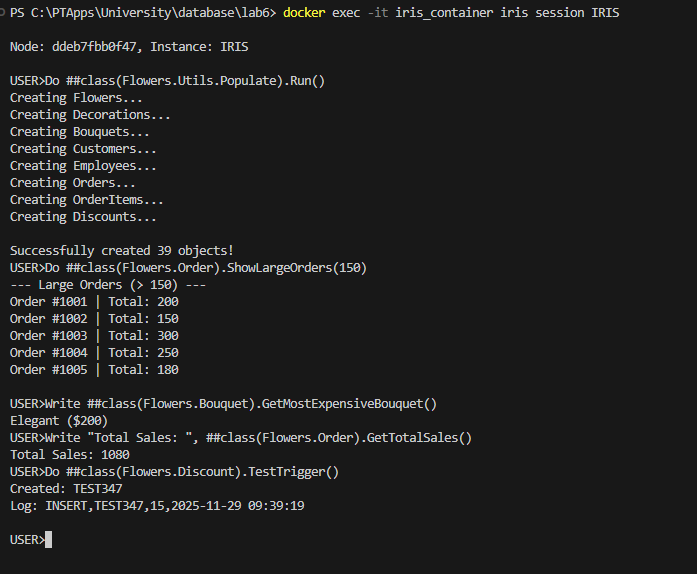
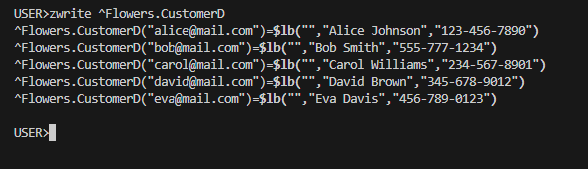
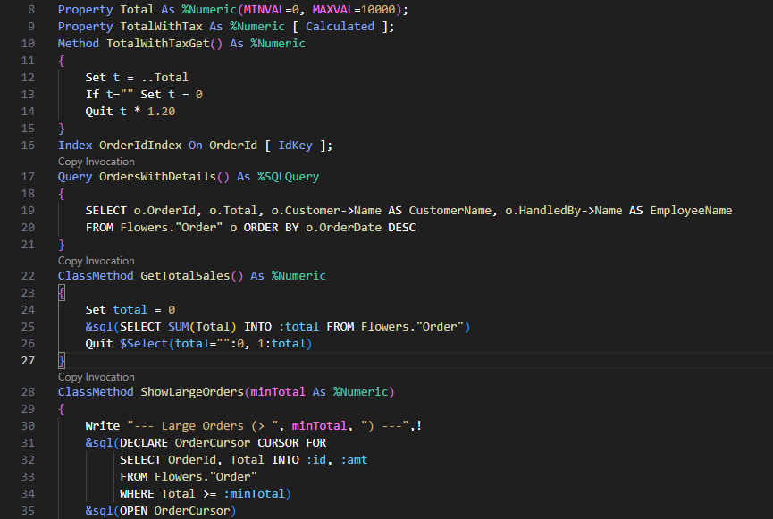

НАЦІОНАЛЬНИЙ ТЕХНІЧНИЙ УНІВЕРСИТЕТ УКРАЇНИ "КИЇВСЬКИЙ ПОЛІТЕХНІЧНИЙ ІНСТИТУТ ІМЕНІ ІГОРЯ СІКОРСЬКОГО”  
НАВЧАЛЬНО-НАУКОВИХ ІНСТИТУТ АТОМНОЇ ТА ТЕПЛОВОЇ ЕНЕРГЕТИКИ  
КАФЕДРА ЦИФРОВИХ ТЕХНОЛОГІЙ В ЕНЕРГЕТИЦІ

Виконав: студент групи ТР-52мп Плесканко А.В.

Перевірив: Волков О.В.

Київ – 2025

# Лабораторна робота №6

### Завдання
Add queries to all classes.
- At least one of them must have arguments.
- At least one of them must be COS based query.
- Use dynamic and embedded SQL (both simple and cursor) in methods.
- Use implicit join (->).
- Create a trigger and code to trigger it.
- Change Unique index to IDKEY and run script for creating objects from practice 4. See that the presentation in Globals changed.
- All methods should make sense

---

### 1. Execution Results

- Демонстрація роботи методів з Embedded SQL, курсорами, Dynamic SQL та спрацювання тригера (лог).
- SQL-запити виконуються, тригер записує у глобал.

### 2. IDKEY Proof

- Демонстрація фізичної структури глобалу через `zwrite ^Flowers.CustomerD`.
- Ключами є Email, а не числові ID (IDKEY).

### 3. Code: Implicit Join

- Фрагмент коду з класу `Flowers.Order`, метод `OrdersWithDetails`.
- Використання синтаксису `->` (`o.Customer->Name`) для отримання даних із зв'язаної таблиці.

---

## Висновок

У ході виконання лабораторної роботи було успішно засвоєно та практично реалізовано розширені можливості роботи з базою даних InterSystems IRIS, 
що дозволило поєднати переваги об'єктного та реляційного підходів. Було опрацьовано різні стратегії доступу до даних: 
використання вбудованого SQL для статичних запитів та курсорів, динамічного SQL для гнучкого формування логіки під час виконання програми,
а також спеціалізованих COS-based запитів для прямої ітерації по глобалах. Важливим етапом стала оптимізація фізичного рівня зберігання даних через заміну стандартних унікальних 
індексів на IDKEY, що дозволило використовувати логічні ключі як фізичні адреси записів у глобалах та підвищити прозорість структури даних.
Функціонал системи розширено за допомогою тригерів для автоматизації логування подій, а використання синтаксису неявного з'єднання дозволило значно спростити код запитів
до зв'язаних об'єктів без необхідності написання громіздких конструкцій JOIN. Це на практиці підтвердило гнучкість та потужність мультимодельної архітектури платформи.
