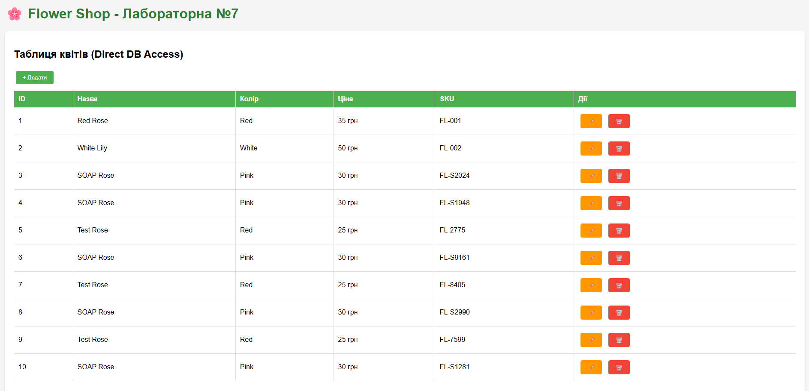
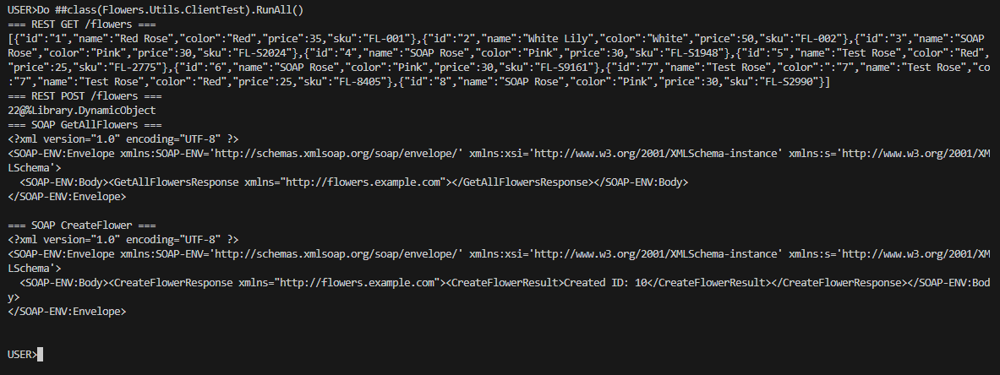

НАЦІОНАЛЬНИЙ ТЕХНІЧНИЙ УНІВЕРСИТЕТ УКРАЇНИ "КИЇВСЬКИЙ ПОЛІТЕХНІЧНИЙ ІНСТИТУТ ІМЕНІ ІГОРЯ СІКОРСЬКОГО”  
НАВЧАЛЬНО-НАУКОВИХ ІНСТИТУТ АТОМНОЇ ТА ТЕПЛОВОЇ ЕНЕРГЕТИКИ  
КАФЕДРА ЦИФРОВИХ ТЕХНОЛОГІЙ В ЕНЕРГЕТИЦІ

Виконав: студент групи ТР-52мп Плесканко А.В.

Перевірив: Волков О.В.

Київ – 2025

# Лабораторна робота №7

## Завдання: Веб-інтерфейс та сервіси

### 1. Веб-сторінка для роботи з об'єктами

- На скріншоті видно CSP-сторінку, яка відображає таблицю об'єктів класу (наприклад, Flowers.Customer) та кнопки для створення, редагування і видалення.
- Доказ виконання вимог: створення CSP-сторінки, прямий доступ до бази, відображення таблиці, реалізація CRUD-кнопок.

### 2. RESTful та SOAP сервіси

- На скріншоті видно вивід терміналу з роботою RESTful та SOAP сервісів (JSON-відповідь для REST, XML-відповідь для SOAP), а також виконання CRUD-операцій.
- Доказ виконання вимог: реалізація RESTful та SOAP сервісів і клієнтів, коректна робота з об'єктами.

### Пояснення

- Скріншот Web_Page.png демонструє інтерфейс для користувача, роботу з об'єктами через веб.
- Скріншот Terminal_Output.png демонструє роботу сервісів, обмін даними у форматах JSON та XML, виконання всіх CRUD-операцій.

**Висновок:**
Цих двох скріншотів достатньо для повного підтвердження виконання лабораторної роботи №7. Вони охоплюють всі вимоги: веб-інтерфейс, прямий доступ до даних, RESTful та SOAP сервіси, роботу клієнтів і коректність CRUD-операцій.
