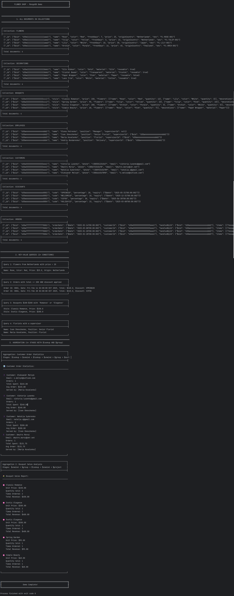
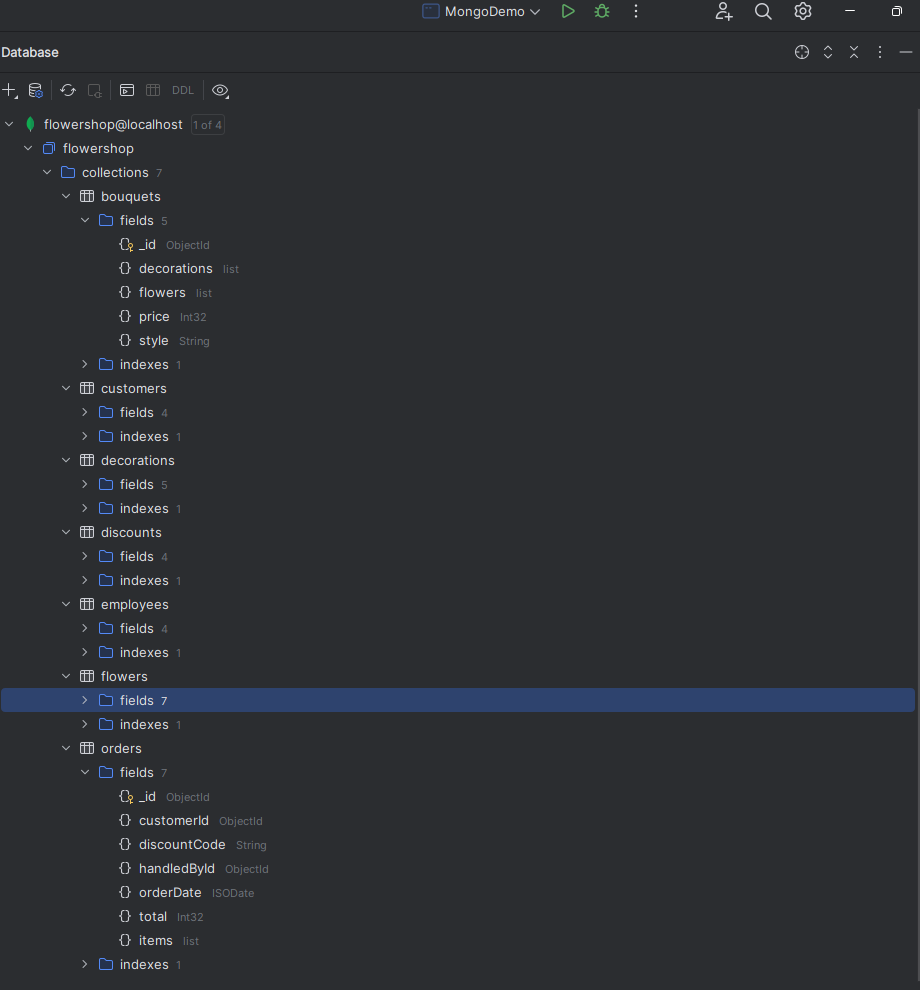

НАЦІОНАЛЬНИЙ ТЕХНІЧНИЙ УНІВЕРСИТЕТ УКРАЇНИ "КИЇВСЬКИЙ ПОЛІТЕХНІЧНИЙ ІНСТИТУТ ІМЕНІ ІГОРЯ СІКОРСЬКОГО”  
НАВЧАЛЬНО-НАУКОВИХ ІНСТИТУТ АТОМНОЇ ТА ТЕПЛОВОЇ ЕНЕРГЕТИКИ  
КАФЕДРА ЦИФРОВИХ ТЕХНОЛОГІЙ В ЕНЕРГЕТИЦІ

Виконав: студент групи ТР-52мп Плесканко А.В.

Перевірив: Волков О.В.

Київ – 2025

# Лабораторна робота №8

---

**Рис. 1. Результати виконання Java-програми**

Консольний вивід: підключення до БД, автоматичне наповнення колекцій тестовими даними, виконання складного запиту з фільтрацією, підсумковий звіт агрегації витрат VIP-клієнтів.

**Рис. 2. Структура бази даних у MongoDB**  

Створена база даних flowershop та колекції, що відповідають сутностям діаграми класів (flowers, orders, customers тощо).

---

## Висновок

У ході виконання лабораторної роботи опановано принципи роботи з документо-орієнтованою СКБД MongoDB. За допомогою Java-драйвера розроблено додаток, що реалізує повний цикл роботи з даними: підключення, генерація тестових наборів, складні вибірки.
